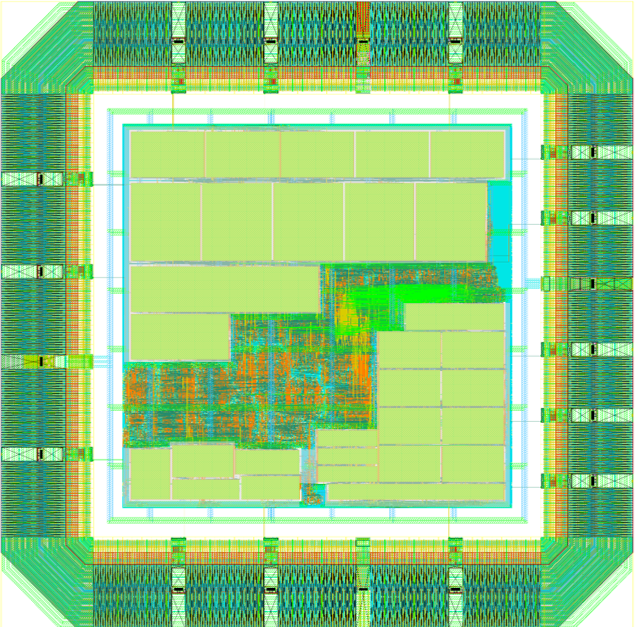
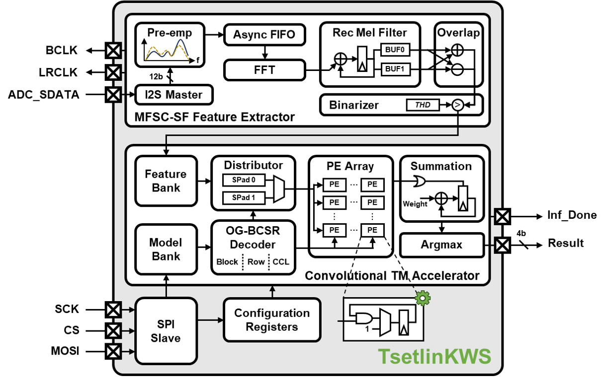
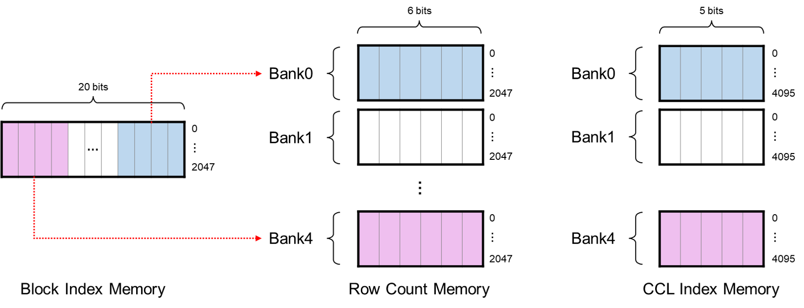
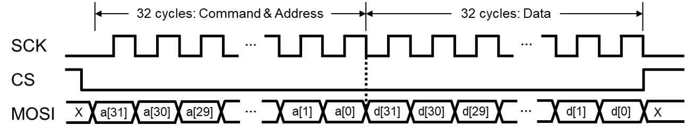

<h1 align="center">
  
  TsetlinKWS: A 65nm 16.58μW, 0.63mm² State-Driven Convolutional Tsetlin Machine-Based Accelerator For Keyword Spotting
</h1>

[](https://arxiv.org/abs/2510.24282)

## 1. Architecture Introduction

TsetlinKWS is a convolutional **Tsetlin** Machine (CTM) accelerator targeting **k**ey**w**ord **s**potting tasks, featuring a state-driven architecture. The accelerator achieves an area of 1.3mm*1.29mm and a power of 16.58 μW under TSMC 65 nm technology, and real-world functional verification is conducted on the Pynq-Z2 platform. Key contributions include:

* **Accuracy Breakthrough**: This work reports the first implementation of the CTM, achieving **87.35%@clean** accuracy on the 12-class keyword spotting task.
* **CTM-Tailored Architecture**: A novel state-driven architecture that simultaneously enables sparse utilization and efficient data reuse, achieving an inference core power of 11.94 μW within a compact core area of 0.63 mm².

### 1.1 System Architecture

<div align="center">
  
  <br>
  <em>Fig. 1: The architecture diagram of TsetlinKWS.</em>

</div>

<br>

Figure 1 illustrates the architecture of TsetlinKWS. For the Convolutional TM accelerator, we propose a state-driven architecture to achieve full sparse utilization and high parallelism simultaneously. The Tsetlin Automaton (TA) action matrices in CTMs are stored as three lists within the **model bank** using the Optimized Grouped Block-Compressed Sparse Row (OG-BCSR) compressed format. The **OG-BCSR decoder** decompresses the list and sends control signals according to the index of included TAs. The **distributor** then routes the **feature bank** data to the processing element (PE) array according to control signals. The **PE array** is a logical computing array with a size of 58x5. Each PE column is responsible for computing four TA action matrices in a time-multiplexing manner. All of the stages in TsetlinKWS are pipelined for maximum throughput.

### 1.2 Memory Organization

The primary memory overhead of TsetlinKWS stems from the compressed storage of Included TAs. The Included TAs are compressed by the OG-BCSR algorithm into three lists: the block index list, the row count list, and the column and clause (CCL) index list. The memory organization is illustrated in Figure 2.

The block index memory is shared across all PE columns. The PE array comprises 5 columns, and each column is responsible for computing 4 TA action matrices. The bandwidth of the block index memory is 20 bits, where each bit corresponds to the block index of one TA action matrix. There are five row count memories and five CCL index memories, respectively, which are accessed separately by their respective PE columns. Since the decompression order can be confirmed offline, the contents of each row count memory and CCL index memory are rearranged to enable sequential access. (At runtime, the read address of the model bank is incremented.)

<div align="center">
  
  <br>
  <em>Fig. 2: The memory organization diagram of the compressed list.</em>

</div>

<br>

Block index memory: This memory is used to store the block index list of the TA action matrix. It is a 40 Kb SP-SRAM, which contains 2048 words of 20 bits. Since the selected model has 120 clauses per class, the actual length of the block index is 1152. Therefore, only the first 1152 words are used.

Row count memory: This memory is used to store the compressed row count list. It is a 12 Kb SP-SRAM, which contains 2048 words of 6 bits. Each word represents the number of included TAs for 2 rows in a block. Each row is represented by 3-bit data, so the number of included TAs per row cannot exceed 7.

CCL index memory: This memory is used to store the compressed column index list and clause index list. It is a 20 Kb SP-SRAM, which contains 4096 words of 5 bits. The MSB is used to represent the clause index and the remaining 4 bits are used to represent the column index.

Clause weight memory: This is a 18 Kb SP-SRAM, which contains 2048 words of 9 bits. The weight of each clause is a 9-bit signed number. Since the selected model has 120 clauses per class, the actual length of clause weights is 1440.

## 2. Configuration interface

### 2.1 SPI Interface

TsetlinKWS achieves programmable configurability through a write-only SPI slave interface. Users can independently train convolutional Tsetlin Machine models to recognize different target keywords. The compressed model parameters and clause weights are written into the memory banks through the SPI interface. The SPI write timing is presented in Figure 3.

<div align="center">
  
  <br>
  <em>Fig. 3: SPI timing diagram.</em>
</div>

<br>
  
The definition of the 32-bit command & address field is shown in the table below:

| a[31]  | a[30:28] | a[27:25]   | a[24:12]                   | a[11:0] |
|--------|----------|------------|----------------------------|---------|
|*r/w*   | *cmd*    | *bank_sel* | *brust_len* (offset of -1) | *addr*  |

* *r/w*: Read:0, Write:1.

* *cmd*: The command code is used to indicate the command type and which region the address points to.

  | *cmd* (a[30:28]) | *addr* (a[11:0])            | Region                  |
  |----------|-------------------------------------|-------------------------|
  | 000      | {N/A, *config_addr[5:0]*}           | Configuration registers |
  | 001      | {N/A, *block_bank_addr[10:0]*}      | Block index memory      |
  | 010      | {N/A, *row_bank_addr[10:0]*}        | Row count memory        |
  | 011      | {N/A, *col_clause_bank_addr[11:0]*} | CCL index memory        |
  | 100      | {N/A, *weight_bank_addr[10:0]*}     | Clause weight memory    |
  | 101      | {N/A, *feature_bank_addr[6:0]*}     | Feature bank            |

* *bank_sel*: The bank selection code is used to select the memory bank to write to. Since 5 memory banks are accessed individually by 5 PE columns, 3 bits are used to indicate the index of the bank.

* *brust_len*: The burst length field is used to indicate the number of consecutive writes to reduce initialization time. The actual burst length is the set value plus one. The maximum burst length is 4096. For the model-related memory, the burst length should not exceed the bank size. If users want to disable the MFSC-SF feature extractor and directly send the feature to the feature bank, the burst length should be set to a fixed value of 127, which means that after sending a command, 128 consecutive 32-bit features will be sent to combine a 64x64 feature bank.

* *addr*: The address field is used to represent the operation address.

### 2.2 Configuration registers

Upon the system power-up, in addition to writing the model parameters into the accelerator, users must also program the configuration registers through the SPI interface. The accelerator can only perform correct inference after completing these two steps. The configuration register definitions are as follows:

| Register Name         | *config_addr* *[5:0]* | Width   | Reset value |Description    |
|-----------------------|---------------|---------|---------|---------------------------|
| *SPI_EN_CONF*         | 0             | 1-bit   | 1'b1    | Enable the configuration function. If it is disabled, all configuration registers will not be updated. |
| *SPI_EN_INF*          | 1             | 1-bit   | 1'b0    | Enable inference. Inference can only be enabled when all configurations are properly set; otherwise, incorrect inference results will occur. When configuration registers are modified or a new model is loaded, it is necessary to first de-assert *SPI_EN_INF*. When *SPI_EN_INF* is pulled low, all system data will be flushed. |
| *SPI_EN_FE*           | 2             | 1-bit   | 1'b1    | Enable feature extraction module. When *SPI_EN_FE* is asserted, the system processes external audio streams through the feature extraction module for full-pipeline keyword spotting. When *SPI_EN_FE* is de-asserted, binary audio features are directly written to the feature bank through the SPI interface. <br>**Note: When *SPI_EN_FE* is de-asserted, ensure to transmit all audio features first before asserting *SPI_EN_INF* high.** |
| *SPI_NUM_CLASS*       | 3             | 4-bit   | 4'd0    | Define the number of keyword classes. |
| *SPI_NUM_CLAUSE*      | 4             | 8-bit   | 8'd0    | Define the number of clauses for each class in CTM. |
| *SPI_NUM_SUM_TIME*    | 5             | 6-bit   | 6'd0    | Define the number of PE array computation cycles required per class. Since the PE array can calculate 2×20 clauses at one round, the calculation formula is: $N_{clause}/2/20$. |
| *SPI_FLUX_TH*         | 6             | 16-bit  | 16'd0   | Define Spectral flux threshold. |
| *SPI_LEN_BLOCK_BANK*  | 7             | 11-bit  | 11'd0   | Define the number of words for the block index bank. |
| *SPI_LEN_ROW_BANK0*   | 8             | 11-bit  | 11'd0   | Define the number of words for the row count bank0. |
| *SPI_LEN_ROW_BANK1*   | 9             | 11-bit  | 11'd0   | Define the number of words for the row count bank1. |
| ...                   | ...           | 11-bit  | 11'd0   | ... |
| *SPI_LEN_ROW_BANK4*   | 12            | 11-bit  | 11'd0   | Define the number of words for the row count bank4. |
| *SPI_LEN_CCL_BANK0*   | 13            | 12-bit  | 12'd0   | Define the number of words for the CCL index bank0. |
| *SPI_LEN_CCL_BANK1*   | 14            | 12-bit  | 12'd0   | Define the number of words for the CCL index bank1. |
| ...                   | ...           | 12-bit  | 12'd0   | ... |
| *SPI_LEN_CCL_BANK4*   | 17            | 12-bit  | 12'd0   | Define the number of words for the CCL index bank4. |
| *SPI_LEN_WEIGHT_BANK* | 18            | 11-bit  | 11'd0   | Define the number of words for the clause weight bank. |

## 3. Deploy TsetlinKWS on Pynq-Z2 Board

The real-world performance of TsetlinKWS can be tested by deploying it on a development board. We select the conventional bare-metal Zynq development methodology, rather than the bloated Pynq framework.

### 3.1 Configure PS Edge

To support TsetlinKWS, the following PS edge peripheral interfaces must be enabled: SPI, I2S, I2C, SD, UART, EMIO and the interrupt function.

* SPI configuration: Due to the system clock frequency being 400 KHz, to ensure the memory is initialized correctly, the SPI clock frequency should not exceed 1/4 of the system clock frequency. Therefore, the CPU frequency should be set to 140 MHz (Input Frequency: 50 MHz, CPU Clock Ratio: 6:2:1), and the SPI frequency should be set to 25 MHz. In the C code, the SPI clock is divided by 256, resulting in a SCK clock of 97.65625 KHz. Additionally, according to the official guide document, the *SPIx_SS_I* pin should be connected to a logic high level.

* I2S Interface: The I2S interface can be connected either to the onboard codec chip or the Pmod interface of the Pynq-Z2 board. The configuration code we provided corresponds to the first option, allowing users to directly test the system using a microphone with a 3.5 mm interface. Due to the differences in sound pickup quality of different microphones, you may need to modify the following code in the [i2s\_master.v](./src_hw/src/feature_extractor/i2s_master.v) file to select the appropriate bit position or may need to re-adjust the configuration of the codec chip.

  ``` verilog
  assign audio_data = audio_data_reg[18:7];
  ```

* I2C Interface: Since the codec chip ADAU1761 on the Pynq-Z2 board requires configuration using the I2C interface, we also need to enable the I2C interface.

* SD: Please copy [model parameters and configuration files](./model) into your TF Card.

* EMIO: Set the bit width to 4 to receive the inference result.

* Interrupt: The *Inf_Done* signal of TsetlinKWS is connected to the PS as an interrupt signal.

### 3.2 The Block Design Diagram for Reference

<div align="center">
  
</div>

## 📄 Paper

> B. Lin, Y. Fang, R. Xu, R. Shafik, and J. Chauhan, “Tsetlinkws: A 65nm 16.58uw, 0.63mm2 state-driven convolutional tsetlin machine-based accelerator for keyword spotting,” 2025. [Online]. Available:https://arxiv.org/abs/2510.24282

## 📰 Revision history

| Rev | Description       | Date          |
|-----|-------------------|---------------|
| 1.0 | Initial version   | Oct. 29, 2025 |

## 📧 Contact

If you have any questions about this work, please feel free to send an email to [bzlin713@163.com](mailto:bzlin713@163.com).

## 📜 License
- **Software Components** (under [`/src_sw/`](./src_sw)):  
  Licensed under [Apache License 2.0](LICENSE#software-components-apache-license-20)
- **Hardware Components** (under [`/src_hw/`](./src_hw)):  
  Licensed under [Solderpad Hardware License v2.1](LICENSE#hardware-components-solderpad-hardware-license-v21)
  